# CLS-DP: Replication Specification

**Paper:** *Distilling Collaborative Dynamics into Latent Space for Implicit Coordination in Decentralized Multi-Agent Manipulation*
**Authors:** Chanyoung Park, Minsung Yoon, Andrew Jeong, Sung-eui Yoon (KAIST)
**arXiv:** 2606.22982v2 [cs.RO]
**Benchmark:** RoboFactory (Qin et al., ICCV 2025) — i.e. *this repository*

This document is a line-by-line extraction of everything in the paper needed to reimplement it, plus an explicit mapping onto the code in this repo and a list of the details the paper leaves underspecified.

---

## 1. TL;DR of the method

CLS-DP is a **decentralized** multi-agent diffusion policy. Each agent runs its own policy on its **own camera only**, with **no** shared global view, **no** global state, and **no** inter-agent communication at deployment.

The trick is a two-stage CTDE (centralized training, decentralized execution) scheme:

- **Stage 1 (Contextualizer).** Train a CVAE whose *posterior* sees privileged information — the future joint trajectories of **all** agents — and whose *prior* sees only the agent's own current RGB frame plus a shared text instruction. KL alignment distills the privileged coordination signal into the prior. The posterior branch is thrown away after training.
- **Stage 2 (Action-Expert).** Freeze the contextualizer. Sample a latent `z` from the prior and condition a per-agent diffusion policy on it via cross-attention.

Result: 38% mean success across six RoboFactory tasks vs 20% for the best centralized baseline, with per-agent inference cost independent of team size.

---

## 2. Notation

| Symbol | Meaning | RoboFactory value |
|---|---|---|
| `N` | number of agents | 2, 3, or 4 (task-dependent) |
| `i` | agent index, `1..N` | `panda-0 .. panda-(N-1)` |
| `L` | observation/proprio history length | **3** |
| `H` | action prediction horizon | **8** |
| `K` | diffusion denoising steps | **100** |
| `d_o` | observation dim | RGB `3x240x320` |
| `d_s` | proprioceptive state dim | **8** |
| `d_a` | action dim | **8** |
| `d_z` | latent dim | **256** |
| `d_f` | SigLIP feature dim | **768** |
| `l` | shared task instruction (text) | sampled per episode |

Sequence definitions (Sec. III):

- `O_t^i := o_{t-L+1:t}^i` — observation history, shape `(L, d_o)`
- `S_t^i := s_{t-L+1:t}^i` — proprio history, shape `(L, d_s)`
- `A_t^i := a_{t:t+H-1}^i` — action sequence, shape `(H, d_a)`
- `A_{t,k}^i` — the action sequence at diffusion step `k`

> **Important asymmetry:** the **prior** consumes only the *current* frame `o_t^i` (a single image), while the **action-expert** consumes the *full history* `O_t^i` (L=3 frames). This is deliberate — see Sec. 4.1.

---

## 3. Problem formulation

Dec-POMDP defined by `<N, S, O, A, P, Z, Q0>`:

- `S = ∏ S_i`, `O = ∏ O_i`, `A = ∏ A_i` with `S_i ⊆ R^{d_s}`, `O_i ⊆ R^{d_o}`, `A_i ⊆ R^{d_a}`
- Transition `P : S x A -> P(S)`
- Per-agent observation function `Z_i : S -> P(O_i)`
- Initial state `s_0 ~ Q0`; `Q0` randomizes initial configurations across episodes

At time `t`, agent `i` receives local image `o_t^i` and proprio state `s_t^i`, plus the shared instruction `l`. It emits `A_t^i ∈ (A_i)^H` from a decentralized policy `π^i(A_t^i | O_t^i, S_t^i, l)`, executed for `H` steps. The joint action `a_u^{1:N}` drives `s_{u+1} ~ P(s_u, a_u^{1:N})`.

---

## 4. Architecture

```mermaid
flowchart TB
    subgraph stage1 [Stage 1: Contextualizer - trains theta_i and psi_i]
        img["o_t^i : current local RGB"] --> vis["SigLIP ViT-B/16 vision - FROZEN"]
        txt["l : shared instruction"] --> tenc["SigLIP text encoder - FROZEN"]
        vis --> fuse["Transformer fusion layers"]
        tenc --> fuse
        fuse --> prior["Prior head -> mu_rho, sigma_rho"]

        priv["Privileged s^1:N_t+1:t+H - all agents"] --> maenc["MA-Kinematics Encoder"]
        maenc --> resid["Residual head -> mu_E, sigma_E"]
        prior --> post["Posterior N(mu_rho + mu_E, sigma_E^2)"]
        resid --> post
        post --> zsamp["z_t^i via reparameterization"]
        zsamp --> madec["MA-Kinematics Decoder"]
        own["s_t^i : own current state"] --> madec
        madec --> recon["Reconstruct s^1:N_t+1:t+H"]
        prior -.->|"KL divergence"| post
    end

    subgraph stage2 [Stage 2: Action-Expert - trains phi_i, contextualizer frozen]
        prior2["z_t^i sampled from FROZEN prior"] --> xattn["Cross-attention into down + mid blocks"]
        hist["O_t^i and S_t^i history L=3"] --> film["ResNet-18 + MLP -> FiLM global cond"]
        xattn --> unet["ConditionalUnet1D denoiser"]
        film --> unet
        unet --> act["Coordinated action sequence A_t^i"]
    end
```



### 4.1 Stage 1 — Contextualizer

#### Prior network `p_θi(z_t^i | o_t^i, l)`  (Eq. 7)

```
p_θi(z_t^i | o_t^i, l) = N(mu_rho^i, diag((sigma_rho^i)^2))
```

- Encodes the **current** local image `o_t^i` and the shared instruction `l` with **frozen pretrained SigLIP encoders** (ViT-B/16, feature dim 768).
- Fuses the two embeddings with **Transformer layers**.
- Outputs `(mu_rho^i, sigma_rho^i)`.

Paper's justification for using only the current frame (quoting Sec. IV-B):

> "only the current local observation serves as input; conditioning on longer histories can make the prior overly informative, preventing `z_t^i` from sufficiently learning collaborative dynamics distilled from the posterior."

This matters. If you feed the prior the full L=3 history, the prior can solve the reconstruction task from its own observations and the latent stops carrying teammate information.

#### Posterior — Multi-Agent Kinematics Encoder `E_ψi`  (Eq. 8)

```
q_ψi(z_t^i | s^{1:N}_{t+1:t+H}) = N(mu_rho^i + mu_E^i, diag((sigma_E^i)^2))
```

- Input is the **privileged future joint trajectories of all N agents**, `s^{1:N}_{t+1:t+H}`, shape `(N, H, d_s)`.
- Implemented with **Transformer layers** to capture cross-agent interactions.
- Predicts **residual** parameters `(mu_E^i, sigma_E^i)`.
- The posterior **mean is residual** (`mu_rho + mu_E`) but the posterior **std is not** — it is `sigma_E` outright, not `sigma_rho + sigma_E`.

#### Reparameterization

```
z_t^i = mu^i + sigma^i * nu,    nu ~ N(0, I)
mu^i    = mu_rho^i + mu_E^i
sigma^i = sigma_E^i
```

#### Multi-Agent Kinematics Decoder `D_ψi`

```
s_hat^{1:N}_{t+1:t+H} := D_ψi(s_t^i, z_t^i)
```

Reconstructs **all N agents'** future trajectories from **only** the agent's own current state `s_t^i` and the latent `z_t^i`. This is the mechanism that forces `z` to carry teammate information: `s_t^i` alone cannot explain what the other arms will do.

#### Loss  (Eq. 9)

```
L_CT(θi, ψi) =
      beta * KL( q_ψi(z_t^i | s^{1:N}_{t+1:t+H})  ||  p_θi(z_t^i | o_t^i, l) )      <- distillation term
    + E_{z ~ q_ψi} [ || s_hat^{1:N}_{t+1:t+H} - s^{1:N}_{t+1:t+H} ||_2^2 ]           <- reconstruction term
```

Stage 1 objective is `sum_{i=1}^{N} L_CT(θi, ψi)` (Eq. 5) — a **separate contextualizer per agent**.

#### The residual parameterization is the whole point — closed-form KL

For diagonal Gaussians the KL is:

```
KL( N(mu_q, sigma_q^2) || N(mu_p, sigma_p^2) )
  = sum_d [ log(sigma_p/sigma_q) + (sigma_q^2 + (mu_q - mu_p)^2) / (2 sigma_p^2) - 1/2 ]
```

Substituting `mu_q = mu_rho + mu_E`, `sigma_q = sigma_E`, `mu_p = mu_rho`, `sigma_p = sigma_rho`, the term `(mu_q - mu_p)` collapses to exactly `mu_E`:

```
KL = sum_d [ log(sigma_rho/sigma_E) + (sigma_E^2 + mu_E^2) / (2 sigma_rho^2) - 1/2 ]
```

**Consequences you must respect when implementing:**

1. `mu_rho` **cancels out of the KL entirely**. Its only gradient comes from the reconstruction term, flowing through `z`. The prior mean is therefore trained *by having to reconstruct all agents' futures*.
2. `sigma_rho` appears **only** in the KL — it is trained purely to match `sigma_E`.
3. The KL drives `mu_E -> 0` and `sigma_E -> sigma_rho`, which is exactly the paper's stated intent: "reducing residual shifts and aligning uncertainty, so that the prior alone suffices at deployment."

If you implement the posterior as an independent (non-residual) Gaussian, you lose property (1) and the distillation mechanism changes character. Keep it residual.

#### Beta warm-up

`beta = 1e-1`, with **linear warm-up over the first 40%** of training. Ramp `0 -> 1e-1` linearly across the first 40% of steps, then hold constant. Without this the KL collapses the latent before the decoder learns anything useful.

### 4.2 Stage 2 — Action-Expert

Objective (Eq. 6): `sum_{i=1}^{N} L_AE(φi ; sg(θi))`. The contextualizer parameters `θi` are frozen via stop-gradient; `ψi` (encoder/decoder) is **discarded** — it exists only in Stage 1.

**Latent source at Stage 2 training time:** `z_t^i` is sampled from the **prior** `p_θi(z_t^i | o_t^i, l)`, *not* the posterior. This is what makes train/deploy consistent.

**Conditioning routes (two distinct mechanisms):**

| Input | Mechanism | Location |
|---|---|---|
| `z_t^i` | **cross-attention blocks** | **downsampling + bottleneck stages only** |
| `O_t^i`, `S_t^i` | **FiLM layers** | throughout, as in vanilla DP |

The paper explicitly restricts `z` injection to the down/mid path, citing that "U-Net features preserve multi-scale spatial information and yield stronger control representations than upsampling-layer features."

**Loss (Eq. 11):**

```
L_AE = E_{A_t^i, eps, k} [ || eps - eps_φi( A_{t,k}^i, k, O_t^i, S_t^i, sg(z_t^i) ) ||_2^2 ],   k ~ Uniform{1..K}
```

Standard epsilon-prediction DDPM loss with the extra `z` conditioning.

**Reverse process (Eq. 10):**

```
A_{t,k-1}^i = lambda_k * ( A_{t,k}^i - gamma_k * eps_φi(A_{t,k}^i, k, O_t^i, S_t^i, z_t^i) ) + eta_k * eps'
```

`lambda_k`, `gamma_k`, `eta_k` are the standard DDPM schedule coefficients from Eq. 3 (`lambda_k = 1/sqrt(alpha_k)`, `gamma_k = (1-alpha_k)/sqrt(1-alphabar_k)`).

### 4.3 Decentralized execution

Per agent, per control cycle:

1. Sample `z_t^i ~ p_θi(z_t^i | o_t^i, l)` — one forward pass through the frozen contextualizer prior.
2. Run the `K`-step reverse denoising conditioned on `(O_t^i, S_t^i, z_t^i)` to produce `A_t^i`.
3. Execute **6 steps** (Table I "Execution steps") of the 8-step horizon.

Formally the deployed policy is the marginal (Eq. 12):

```
π^i(A_t^i | O_t^i, S_t^i, l) = ∫ τ_φi(A_t^i | z_t^i, O_t^i, S_t^i) p_θi(z_t^i | o_t^i, l) dz_t^i
```

Nothing is exchanged between agents. Per-agent compute is constant in `N`.

---

## 5. Hyperparameters (Table I — complete)

**Shared across all methods:**

| Parameter | Value |
|---|---|
| Learning rate | `1e-4` |
| Batch size (action-expert) | `32` |
| Denoising steps `K` | `100` |
| Prediction horizon `H` | `8` |
| History length `L` | `3` |
| Execution steps | `6` |
| Epochs | `100` |
| Optimizer | Adam, LR warm-up then cosine decay |
| Policy obs encoder | ResNet-18 + lightweight MLP |

**Contextualizer-specific:**

| Parameter | Value |
|---|---|
| Vision encoder | ViT-Base (SigLIP ViT-B/16), frozen |
| Text encoder | ViT-Base (SigLIP), frozen |
| Feature dim | `768` |
| Latent dim `d_z` | `256` |
| Batch size | `512` |
| KL weight `beta` | `1e-1` |
| `beta` warm-up | linear, 40% |

Note the policy vision backbone is **ResNet-18**, standardized across all methods for fair comparison. SigLIP appears **only inside the contextualizer**.

---

## 6. Tasks and evaluation protocol

Six RoboFactory tasks. Agent counts verified against the configs in this repo:

| Task | `task_name` | Config | N |
|---|---|---|---|
| Lift Barrier | `LiftBarrier` | `configs/table/lift_barrier.yaml` | 2 |
| Place Food | `PlaceFood` | `configs/table/place_food.yaml` | 2 |
| Two Robots Stack Cube | `TwoRobotsStackCube` | `configs/table/two_robots_stack_cube.yaml` | 2 |
| Camera Alignment | `CameraAlignment` | `configs/table/camera_alignment.yaml` | 3 |
| Three Robots Stack Cube | `ThreeRobotsStackCube` | `configs/table/three_robots_stack_cube.yaml` | 3 |
| Take Photo | `TakePhoto` | `configs/table/take_photo.yaml` | 4 |

These cover the three coordination archetypes the paper names: **tight synchronization**, **role-asymmetric coordination**, and **strict sequential dependency**.

**Evaluation:** 100 episodes per task with **unseen seeds** that vary target object placement.

**Coordination failure modes the method is meant to fix** (Fig. 3):

1. Object drop from unsynchronized lifting (one lifts while the other holds).
2. Inter-agent collision from violated sequential dependencies (simultaneous picking instead of ordered).
3. Backward tilt from imbalanced asymmetric lifting.

---

## 7. Text instructions

- Instructions are generated by an **LLM** from the task and object descriptions provided by RoboFactory.
- Following RoboTwin 2.0, phrasings are diversified: **100 instructions for training, 100 held-out for evaluation**, per task.
- **One instruction is sampled per episode and shared across all agents.**

Examples given in Table IV:

- **Lift Barrier** — "Lift the metal barrier and keep it straight." / "Grasp the metal barrier firmly and raise it to the target height."
- **Place Food** — "Lift the pot lid and place a small piece of food inside." / "Open the lid and move the food item to the center of the pot."
- **Two Robots Stack Cube** — "Move the blue cube to the target and stack the red cube on top." / "Position the blue cube and stack the red cube."
- **Camera Alignment** — "Place the object at its target position and raise the camera to match." / "Hold the object at its target position and align the camera precisely."
- **Three Robots Stack Cube** — "Place the blue cube, then stack the red and green cubes on top." / "Position the blue cube and carefully place the red and green cubes."
- **Take Photo** — "Move the object to the target, align the camera, then press the shutter." / "Place the object, align the camera, and press the shutter afterward."

> Note a naming mismatch to watch for: the Two/Three Robots Stack Cube instructions mention **blue/red/green** cubes, but this repo's configs define `cubeA` blue, `cubeB` green, `cubeC` red. Generate instructions from the actual config colors.

---

## 8. Baselines and target numbers

### Centralized
A unified policy takes all agents' local observations and jointly predicts all actions.

- **DP** — vanilla diffusion policy
- **LargeDP** — parameter-scaled DP, isolates the effect of model size
- **2D Dense Policy** — bidirectional autoregressive action learning from 2D obs
- **DP3 (XYZ)** and **DP3 (XYZ+RGB)** — 3D point cloud diffusion policy
- **3D Dense Policy** — Dense Policy on point clouds
- **Global GauDP** — reconstructs a global 3D Gaussian field via Gaussian splatting from all agents' local views

### Decentralized
- **Local GauDP** — per-agent GauDP policies
- **Ours w/o CLS** — the key ablation: decentralized DP with **no** `z`

### Table II — success rates (%)

| Method | Lift Barrier (2) | Place Food (2) | Stack Cube (2) | Camera Align. (3) | Stack Cube (3) | Take Photo (4) | Total |
|---|---|---|---|---|---|---|---|
| DP | 9 | 12 | 6 | 3 | 0 | 0 | 5 |
| LargeDP | 60 | 12 | 4 | 29 | 0 | 0 | 18 |
| 2D Dense Policy | 3 | 2 | 0 | 0 | 0 | 9 | 2 |
| DP3 (XYZ) | 30 | 21 | 1 | 3 | 0 | 9 | 11 |
| DP3 (XYZ+RGB) | 31 | 25 | 1 | 18 | 0 | 11 | 14 |
| 3D Dense Policy | 28 | 18 | 0 | 0 | 0 | 7 | 9 |
| Global GauDP | 72 | 15 | 2 | 26 | 0 | 3 | 20 |
| Local GauDP | 3 | 12 | 0 | 15 | 0 | 2 | 5 |
| **CLS-DP (ours)** | **61** | **43** | **39** | **55** | **20** | **8** | **38** |
| Ours w/o CLS | 14 | 5 | 14 | 7 | 8 | 3 | 9 |

**Key reproduction signals:**

- The `CLS-DP` vs `Ours w/o CLS` gap (38 vs 9) is the headline ablation. If your reimplementation does not show a large gap here, the latent is not carrying coordination information.
- CLS-DP is the **only** method with non-trivial Three Robots Stack Cube performance (20%); every other method scores 0%.
- CLS-DP **loses** on Take Photo (8% vs DP3 XYZ+RGB 11%). The paper attributes this to fine-grained spatial precision for the shutter press, not missing coordination cues. Do not treat this as a bug.
- Lift Barrier is the one task where a centralized baseline wins (Global GauDP 72% vs 61%).

### Table III — efficiency (success % per M params)

| Method | 2 Agents | 3 Agents | 4 Agents |
|---|---|---|---|
| DP | 0.0693 | 0.0092 | 0.0000 |
| LargeDP | 0.0351 | 0.0152 | 0.0000 |
| GauDP-G (policy only) | 0.0395 | 0.0166 | 0.0037 |
| GauDP (with reconstruction) | 0.0068 | 0.0035 | 0.0009 |
| **CLS-DP+K (ours)** | 0.2013 | 0.1124 | 0.0186 |
| **CLS-DP (ours)** | **0.2056** | **0.1148** | **0.0190** |

`CLS-DP+K` is the conservative variant that *also* counts the MA-kinematics encoder/decoder that exist only during training.

**Derived parameter budgets** (not stated in the paper — computed as `mean success / efficiency`, useful as sizing targets):

- CLS-DP total: ~232M (2 agents), ~327M (3), ~421M (4)
- Implied marginal cost: **~95M per agent** on top of a **~42M constant base**
- CLS-DP+K minus CLS-DP: ~5.0M / ~6.9M / ~9.0M, i.e. the **MA-kinematics encoder + decoder pair is only ~2.3M params per agent**

That last number is a genuinely useful design constraint: the privileged branch is small — roughly a 2–4 layer transformer at modest width, not a large model.

---

## 9. Analyses to reproduce

### 9.1 Cross-modal grounding (Fig. 4)

Measure cross-attention weight mass in the contextualizer, split between text tokens and image tokens. Reported values:

| Task | Text | Image | Δ |
|---|---|---|---|
| Place Food | 0.578 | 0.422 | 0.156 |
| Two Robots Stack Cube | 0.545 | 0.455 | 0.090 |
| Lift Barrier | 0.537 | 0.463 | 0.074 |
| Three Robots Stack Cube | 0.522 | 0.478 | 0.044 |
| Camera Alignment | 0.510 | 0.490 | 0.020 |
| Take Photo | 0.509 | 0.491 | 0.018 |

Interpretation given by the paper:

- Text mass is consistently **above 0.5** on every task — the contextualizer leans slightly but reliably on language for task-level coordination structure.
- **Place Food** has the largest gap because its instructions encode role-asymmetric ordering (open the lid *before* placing food).
- The gap **narrows** from Two (0.090) to Three (0.044) Robots Stack Cube, consistent with more stacking steps requiring more visual verification.
- **Camera Alignment** and **Take Photo** have the smallest gaps because camera-to-target matching is inherently visual.

> Design implication: the weights are reported as a two-way split summing to 1.0, so your fusion module needs a well-defined attention distribution over {text, image}. The cleanest way to make this measurable is a learned query token attending over a concatenated `[text tokens ; image tokens]` sequence, then summing attention mass per modality.

### 9.2 Attribution maps (Fig. 1, Fig. 5)

**Integrated Gradients** on the local image observation with respect to the predicted action sequence, over the Take Photo episode.

- **With CLS:** attribution covers the agent's own joints/gripper **and its teammates'** joints/grippers, and stays temporally coherent as execution progresses.
- **Without CLS:** attribution is sparse and egocentric, concentrated on the agent's own arm only; the camera gets misaligned and dropped.

Notably, the ablated baseline also fails at grabbing target 2 — a subtask requiring **no** coordination. The paper reads this as evidence that `z` encodes the agent's own task progression in addition to teammate dynamics.

---

## 10. Mapping onto this repository

### 10.1 What already lines up exactly

The paper's hyperparameters were clearly chosen against this repo's DP config. These already match `robofactory/policy/Diffusion-Policy/diffusion_policy/config/robot_dp.yaml`:

| Paper | Repo |
|---|---|
| `H = 8` | `horizon: 8` |
| `L = 3` | `n_obs_steps: 3` |
| `K = 100` | `num_train_timesteps: 100`, `num_inference_steps: 100` |
| Execution steps `= 6` | `predict_action` slices `action_pred[:, 2:10]` on a length-8 tensor, yielding 6; `eval_multi_dp.py` consumes them with `for i in range(6)` |
| ResNet-18 + MLP encoder | `MultiImageObsEncoder` with `get_resnet(name: resnet18)` |
| FiLM conditioning | `ConditionalResidualBlock1D` with `cond_predict_scale: True` |
| LR `1e-4` | `lr: 1.0e-4` |

Deltas to change: `num_epochs: 300 -> 100`, `batch_size: 64 -> 32`.

### 10.2 Concrete tensor shapes

For a task with `N` agents:

```
o_t^i                     (3, 240, 320)          uint8 -> float in [0,1]
O_t^i                     (3, 3, 240, 320)       L=3 frames
S_t^i                     (3, 8)                 L=3 x d_s
A_t^i                     (8, 8)                 H=8 x d_a
s^{1:N}_{t+1:t+H}         (N, 8, 8)              privileged target
z_t^i                     (256,)
```

The privileged reconstruction target is `N*H*d_s` values — 128 for N=2, 256 for N=4.

### 10.3 The data pipeline problem (most important integration work)

**Finding:** in `robofactory/script/parse_h5_to_pkl_multi.py`, both fields are written from the same source array:

```python
joint_action=res["action"][f'panda-{agent_id}'][j],
endpose=res["action"][f'panda-{agent_id}'][j],
```

and in `parse_pkl_to_zarr_dp.py`, `state` and `action` are both `joint_action_arrays`. So in the existing zarr, **`state`, `action`, and `tcp_action` are all the same data**: the 8-D commanded joint vector (7 arm joints + 1 gripper).

Two consequences:

1. `d_s = d_a = 8`, and `s_t^i` is the commanded joint target, not measured qpos. This is consistent with eval, where `agent_pos` is fed from the previously executed action after reset.
2. The privileged target `s^{1:N}_{t+1:t+H}` is therefore **exactly the future action trajectories of all agents**, one step offset from `A_t^i = a_{t:t+H-1}`.

**The blocker:** the current pipeline writes one zarr **per agent** (`{task}_Agent{id}_{num}.zarr`), each containing only that agent's `head_camera`, `state`, `action`. There is no artifact holding all agents' states time-aligned, which the posterior requires.

**Good news:** alignment is already guaranteed upstream. `parse_h5_to_pkl_multi.py` loops `for agent_id in range(agent_num + 1)` over the *same* episode `i` and step `j`, with `min_len` computed once from `panda-0`. So episode index and step index are directly comparable across the per-agent pkl directories. (It also emits a `{task}_global` directory from `head_camera_global` with `joint_action=None` — unused here, since CLS-DP explicitly forbids global views.)

**Required new artifact** — a multi-agent zarr per task:

```
{task}_multi_{num}.zarr
  data/
    head_camera_agent0 .. head_camera_agent{N-1}    (T, 3, 240, 320) uint8
    state_agent0       .. state_agent{N-1}          (T, 8) float32
    action_agent0      .. action_agent{N-1}         (T, 8) float32
    instruction_id                                   (T,) int64
  meta/
    episode_ends                                     (E,) int64
```

`episode_ends` is shared across agents because steps are aligned. `instruction_id` indexes into the per-task instruction bank so a single instruction is constant within an episode.

### 10.4 Where the cross-attention goes

In `diffusion_policy/model/diffusion/conditional_unet1d.py`, the structure is:

```170:237:robofactory/policy/Diffusion-Policy/diffusion_policy/model/diffusion/conditional_unet1d.py
        for idx, (resnet, resnet2, downsample) in enumerate(self.down_modules):
            x = resnet(x, global_feature)
            if idx == 0 and len(h_local) > 0:
                x = x + h_local[0]
            x = resnet2(x, global_feature)
            h.append(x)
            x = downsample(x)

        for mid_module in self.mid_modules:
            x = mid_module(x, global_feature)
```

Per the paper, insert cross-attention blocks in **`down_modules`** and **`mid_modules`** only — leave `up_modules` untouched. With `down_dims: [256, 512, 1024]` there are 3 down levels and 2 mid blocks, so 5 injection sites. Query = U-Net features `x` of shape `(B, C, T')` transposed to `(B, T', C)`; key/value = `z` projected to tokens.

### 10.5 New modules required

| Module | Purpose | Rough size |
|---|---|---|
| `SigLIPPriorNet` | frozen SigLIP + transformer fusion -> `(mu_rho, sigma_rho)` | frozen backbone + small head |
| `MAKinematicsEncoder` | `(N,H,8) -> (mu_E, sigma_E)` | ~1M |
| `MAKinematicsDecoder` | `(s_t^i, z) -> (N,H,8)` | ~1M |
| `ContextualizerWorkspace` | Stage 1 training loop | — |
| `CrossAttentionBlock` | `z` injection into UNet | small |
| `CLSDiffusionUnetImagePolicy` | Stage 2 policy | ~80M |
| Multi-agent dataset + parse script | privileged batching | — |

Per Sec. 8, target ~2.3M total for the encoder+decoder pair.

### 10.6 Integration seams that must be preserved

From the existing framework contract:

- `RobotWorkspace` calls `self.model.compute_loss(batch)` expecting a scalar, and `policy.predict_action(obs_dict)` expecting a dict with both `action` and `action_pred`.
- Eval-time loading in `eval_multi_dp.py::get_policy` reconstructs a workspace from `cfg._target_` stored in the checkpoint, then reads `workspace.model` / `workspace.ema_model`. Keep those attribute names.
- Checkpoints land at `checkpoints/{zarr_stem}/{epoch+1}.ckpt`, so the zarr filename determines the checkpoint directory.
- `DPRunner.get_action` hard-filters the obs dict down to `head_cam` and `agent_pos`. Adding the instruction or latent to the runtime obs requires editing it.
- `training.freeze_encoder` dereferences `self.model.obs_encoder` directly — keep that attribute or keep the flag `False`.

### 10.7 A practical optimization

Both SigLIP towers are **frozen**, and the prior consumes only the **current** frame. So SigLIP features can be precomputed offline once per frame and once per instruction, letting Stage 1 train at batch size 512 cheaply.

Caveat: if you want the Fig. 4 cross-attention analysis, you need **token-level** features, not pooled ones, and caching 196 patch tokens x 768 per frame is larger than the source image. Either cache pooled embeddings and accept a 1-token-per-modality attention split, or recompute SigLIP on the fly.

---

## 11. Underspecified details and recommended defaults

The paper does not state these. Choices below are consistent with the stated numbers and with the derived parameter budgets in Sec. 8.

| # | Unspecified | Recommendation |
|---|---|---|
| 1 | Transformer depth/heads in the prior fusion | 2–4 layers, 8 heads, width 768 |
| 2 | MA-Kin encoder/decoder depth | 2–4 layers, width 256–384; total ~2.3M for the pair |
| 3 | How `z` becomes cross-attention keys/values | Linear project `z (256)` to `M` tokens; `M = 1..4` |
| 4 | Whether tokenization is per-agent or per-timestep in the MA-Kin encoder | Flatten to `N*H` tokens of dim `d_s` with learned agent + time embeddings; this is what lets it model cross-agent interaction |
| 5 | Decoder query construction for `(N,H)` outputs | `N*H` learned query tokens cross-attending to `[z ; s_t^i]` |
| 6 | Stage 1 epoch count | Paper says "all methods 100 epochs"; ambiguous whether this covers Stage 1. Default 100 |
| 7 | Noise schedule | Repo default `squaredcos_cap_v2`, `beta_start 1e-4`, `beta_end 0.02` |
| 8 | Whether `sigma` heads output log-variance | Yes — predict `log sigma` and exponentiate, for stability |
| 9 | Reconstruction loss reduction | Sum over `(N,H,d_s)` then mean over batch; matches the `||·||_2^2` in Eq. 9 |
| 10 | Whether EMA is used | Repo defaults to EMA on; paper is silent. Keep on for Stage 2 |
| 11 | Exact SigLIP checkpoint | `ViT-B/16`, feature dim 768 (consistent with `google/siglip-base-patch16-224`) |
| 12 | Whether contextualizers share weights across agents | Eq. 5 sums over per-agent `(θi, ψi)`, so **separate per agent** |
| 13 | Latent resampling frequency at deployment | `z_t^i` is indexed by `t`, so resample once per control cycle (every 6 executed steps) |
| 14 | Warm-up steps for the LR schedule | Repo default 500 steps |

---

## 12. Implementation order

1. **Instruction bank.** Generate 100 train + 100 eval phrasings per task from the config object names. Store as JSON keyed by task.
2. **Multi-agent data.** Write `parse_pkl_to_zarr_multi.py` producing the layout in Sec. 10.3. Verify `episode_ends` is identical across agents.
3. **Dataset.** A `MultiAgentImageDataset` yielding, for agent `i`: `O_t^i (3,3,240,320)`, `S_t^i (3,8)`, `A_t^i (8,8)`, `o_t^i (3,240,320)`, `instruction_id`, and privileged `(N,8,8)`.
4. **Stage 1.** Prior net, MA-Kin encoder/decoder, residual CVAE loss with the closed-form KL from Sec. 4.1, linear beta warm-up over 40%. Sanity check: reconstruction error on *teammates'* future trajectories must beat an `s_t^i`-only baseline, otherwise `z` is not carrying coordination signal.
5. **Stage 2.** Add cross-attention to `down_modules` + `mid_modules`, freeze the contextualizer, sample `z` from the prior, train with `L_AE`.
6. **Eval.** Per-agent latent sampling and 6-step execution in a variant of `eval_multi_dp.py`, keeping the TOPP smoothing stage.
7. **Ablation.** Train `Ours w/o CLS` (same policy, no `z`). The 38 vs 9 gap is the primary correctness check.
8. **Analyses.** Cross-attention split (Fig. 4) and Integrated Gradients maps (Fig. 5).

---

## 13. Quick-reference equation list

| Eq. | Content |
|---|---|
| 1 | `x_k = sqrt(alphabar_k) x_0 + sqrt(1-alphabar_k) eps` |
| 2 | `L_Diffusion = E[ ||eps - eps_Phi(x_k,k)||^2 ]` |
| 3 | `x_{k-1} = (1/sqrt(alpha_k))(x_k - ((1-alpha_k)/sqrt(1-alphabar_k)) eps_Phi(x_k,k)) + eta_k eps'` |
| 4 | `L_DP = E[ ||eps - eps_Phi(A_{t,k},k,O_t,S_t)||^2 ]` |
| 5 | Stage 1: `sum_i L_CT(θi, ψi)` |
| 6 | Stage 2: `sum_i L_AE(φi; sg(θi))` |
| 7 | `p_θi(z|o,l) = N(mu_rho, diag(sigma_rho^2))` |
| 8 | `q_ψi(z|s^{1:N}) = N(mu_rho + mu_E, diag(sigma_E^2))` |
| 9 | `L_CT = beta*KL(q||p) + E_q[ ||s_hat - s||^2 ]` |
| 10 | `A_{t,k-1} = lambda_k(A_{t,k} - gamma_k eps_φi(...)) + eta_k eps'` |
| 11 | `L_AE = E[ ||eps - eps_φi(A_{t,k},k,O_t,S_t,sg(z))||^2 ]` |
| 12 | `π^i = ∫ τ_φi(A|z,O,S) p_θi(z|o,l) dz` |
