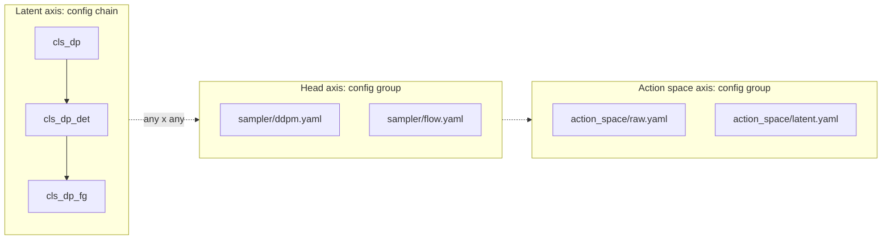

# CLS-DP Variant: Flow-Matching Action Expert ("Study FM")

Design notes for replacing the Stage 2 100-step DDPM action expert with a flow-matching
(rectified-flow / conditional-OT) expert. The goal is inference latency; success rate is a
secondary, genuinely open question.

Related: [CLS-DP-replication-spec.md](CLS-DP-replication-spec.md) (paper extraction),
[CLS-DP-implementation-notes.md](CLS-DP-implementation-notes.md) (baseline + study log),
[CLS-DP-improvements.md](CLS-DP-improvements.md) (ranked idea list; this is proposal 5),
[CLS-DP-variant-factorized-grounded.md](CLS-DP-variant-factorized-grounded.md) (Study FG).

Status: **implemented, not yet trained.** `sampler=flow` selects the FM policy. Temporal
consistency defaults off; latent action space is a separate `action_space=latent` group.

---

## 1. Why Stage 2 only

Stage 1 has no sampler. The contextualizer is a CVAE: `PriorNet` emits `(mu_rho, sigma_rho)` in
one forward pass, `sample_latent` reparameterizes once, and `MAKinematicsDecoder` reconstructs
all agents' futures in one more pass. There is no iterative denoising to accelerate, and flow
matching is not applicable in the first place — `z` is not *generated*, it is *encoded*, and its
training signal is KL alignment plus reconstruction, not a transport objective.

So Stage 1 is byte-identical to whatever study we branch from, and the FM variant reuses that
study's Stage 1 checkpoints directly. **Study FM does not retrain Stage 1.** `train_study_fm.sh`
requires existing Study B `*_ctx_*` files and trains only `*_clsdpfm_*`; `train_cls_stage1.sh`
refuses to overwrite an existing `100.ckpt` unless `FORCE_OVERWRITE_CTX=1`. That keeps the
sampler swap attributable: same frozen prior, different Stage 2 transport.

`CLSRobotWorkspace._load_prior_weights` pulls only `prior_net.*`, which is identical across
every variant, so `*_ctx_*`, `*_ctxdet_*` and `*_ctxfg_*` all load into an FM Stage 2 without
modification.

Where the 100 steps actually cost us:

```
per control cycle, per agent:
  1x  prior_net forward           (frozen, cheap)
  1x  obs_encoder forward         (ResNet-18, cheap)
  100x CLSConditionalUnet1D       <-- the entire cost
  then 6 executed steps of TOPP + sim
```

**Set expectations honestly.** The sampler drops from 100 U-Net calls to ~4, roughly 25x on that
component. End-to-end episode wall-clock will improve by far less, because `eval_multi_cls_dp.py`
calls `predict_action` once per macro-cycle and then spends 6 iterations on TOPP smoothing and
simulator substeps. We should measure both numbers separately and report both (section 7).

---

## 2. Composability: two orthogonal axes

The existing variants form a linear Hydra chain, `cls_dp` -> `cls_dp_det` -> `cls_dp_fg`. The
generative head is not on that axis — it is orthogonal to what the latent does. Chaining would
force a full cross-product of config files.

Instead the head becomes a Hydra **config group** that can be layered onto any study, present or
future:



`cls_dp.yaml` gains `sampler: ddpm` and `action_space: raw` to its `defaults:`, which the `_det`
and `_fg` configs inherit for free. Switching heads is then a CLI group override:

```bash
python train.py --config-name=cls_dp_det.yaml sampler=flow action_space=raw
```

### Checkpoint naming

Today each variant hardcodes `checkpoint_name`. That does not compose. Replace it with two tag
variables:

```yaml
# cls_dp.yaml
latent_tag: ""      # cls_dp_det.yaml sets "det", cls_dp_fg.yaml sets "fg"
head_tag: ""        # sampler/flow.yaml sets "fm"
space_tag: ""       # action_space/latent.yaml sets "la"
horizon_tag: ""     # horizon/h25.yaml sets "h25"
checkpoint_name: ${task_name}_clsdp${latent_tag}${head_tag}${space_tag}${horizon_tag}_Agent${agent_id}_${data_num}
```

With all tags empty this resolves to `LiftBarrier-rf_clsdp_Agent0_150` — **byte-identical to
today**, so Study B, DET and FG checkpoint paths are unchanged. New combinations name themselves:
`clsdpfm` (Study B + flow), `clsdph25` / `clsdpfmh25` (Study B + horizon 25, DDPM or flow),
`clsdpdetfm` (DET + flow), `clsdpfgfmh25` (FG + flow + horizon 25).

`eval_cls_sweep.sh` already takes an arbitrary prefix string as its 9th argument, so evaluation
needs no changes at all. The existing `verify_cls_pipeline.py` assertions (`"clsdpdet" in
cfg2.checkpoint_name`) guard the refactor from regressing.

---

## 3. The flow-matching objective, in the diffusers convention

Adopt the same `sigma` convention as `FlowMatchEulerDiscreteScheduler` so our math can be
cross-checked against a reference implementation (section 8).

Let `x1` be the clean normalized action chunk `(B, 8, 8)` and `eps ~ N(0, I)`. With
`sigma` running from 1 (pure noise) to 0 (data):

```
forward interpolation:   x_sigma = sigma * eps + (1 - sigma) * x1
velocity target:         v      = eps - x1              <-- constant in sigma
training loss:           || v_hat(x_sigma, sigma, cond) - v ||^2
```

The target is `dx/dsigma` along the straight line joining `eps` to `x1`. Two identities that fall
out and are worth asserting in tests:

```
x_sigma = sigma * v + x1        =>   x1 = x_sigma - sigma * v
```

Sampling integrates the ODE from `sigma = 1` down to `sigma = 0`:

```
x <- x + (sigma_next - sigma) * v_hat        # sigma_next < sigma, so this moves toward data
```

which is literally `FlowMatchEulerDiscreteScheduler.step`.

### Three things the diffusers scheduler cannot do for us

Read from the pinned `diffusers==0.32.2` source, not from docs:

1. **`scale_noise` is unusable for training.** It resolves `sigma` via `index_for_timestep`, which
   does an exact-equality lookup `(schedule_timesteps == timestep).nonzero()` against the discrete
   1000-entry grid. A continuous `sigma` produces an empty match and an `IndexError`. So the
   forward interpolation must be hand-rolled — which is two lines anyway.
2. **`config` has no `prediction_type`.** The inherited `compute_loss` reads
   `self.noise_scheduler.config.prediction_type` and would raise `AttributeError`. The FM policy
   overrides `compute_loss` wholesale, so this never executes, but it rules out a
   drop-in-scheduler-only change.
3. **`step` carries hidden mutable state** (`_step_index`, reset only by `set_timesteps`) and
   rejects integer timesteps. Workable, but a footgun next to EMA and repeated calls.

Verdict: hand-roll a ~30-line transport module. Keep the diffusers scheduler as a **test
oracle** rather than a runtime dependency — `verify_cls_dp.py` asserts our Euler step matches
`FlowMatchEulerDiscreteScheduler.step` numerically on the same sigma grid. That buys correctness
assurance against a reference without inheriting its state machine.

### The timestep-embedding gotcha

This one would silently cost most of the run. `SinusoidalPosEmb` builds frequencies spanning
`1.0` down to `1e-4`:

```10:17:robofactory/policy/Diffusion-Policy/diffusion_policy/model/diffusion/positional_embedding.py
    def forward(self, x):
        device = x.device
        half_dim = self.dim // 2
        emb = math.log(10000) / (half_dim - 1)
        emb = torch.exp(torch.arange(half_dim, device=device) * -emb)
        emb = x[:, None] * emb[None, :]
        emb = torch.cat((emb.sin(), emb.cos()), dim=-1)
        return emb
```

Under DDPM it receives integers in `[0, 100)`. Feed it `sigma` in `[0, 1]` and the highest
frequency spans `[0, 1]` while the other 63 span `[0, 1e-4]` — around one of 128 dimensions
carries usable signal and the model is close to blind to its own noise level.

Fix: pass `sigma * timestep_scale` with `timestep_scale: 1000.0`, matching diffusers'
`timesteps = sigmas * num_train_timesteps`. Pin it as a test: assert cross-dimension variance of
the embedding is above a threshold when scaled and below it when not.

### Sigma sampling during training

Originally defaulted to the least opinionated option so the first run was a clean swap. That
first run is now done, and the default has moved to `beta` at scale 1.5 — see the step-count
result in section 10:

| `sigma_dist` | Draw | Notes |
|---|---|---|
| `beta` (default, scale 1.5) | Beta(1.5, 1) toward `sigma -> 1` | pi0/pi0.5/SmolVLA/GR00T/WALL-X all use exactly this |
| `uniform` | `U(0, 1)` | The original "pure swap". What the first FM checkpoint trained with |
| `logit_normal` | `sigmoid(m + s * randn)` | SD3's choice; concentrates on mid-sigma. Wants scale back at 1.0 |

`sigma_dist_scale` means a different thing per distribution (`a` in Beta(a, 1) versus the
logit-normal's std), so it defaults to `None` and each distribution resolves its own field
standard. Note this knob is **training-time only** — it cannot change an existing checkpoint.

Our `sigma = 1` is noise, matching openpi's `x_t = t * noise + (1 - t) * actions`, so pi0's
bias direction carries over without a sign flip. Verified numerically against
`torch.distributions.Beta(1.5, 1.0)` in `verify_cls_dp.py`: mean 0.596 vs 0.600, and 64.5% of
mass above `sigma = 0.5` against uniform's 50%.

Also expose `shift` (the SD3/Flux time-shift `sigma' = shift*sigma / (1 + (shift-1)*sigma)`) with
default `1.0`, i.e. off. [CLS-DP-improvements.md](CLS-DP-improvements.md) section 4 already argues
the optimal shift here is near zero because the action tensor is only `8x8 = 64` values, and lists
shifted schedules under "Decided against" for that reason. Keeping the knob costs nothing and
keeping the default at 1.0 respects that analysis.

### Solver

`euler` (1 model call per step) and `midpoint` (2 calls, second-order). At very low step counts
midpoint often beats euler at equal *wall-clock*, because 2 calls of a 2nd-order method can beat
4 calls of a 1st-order one. Worth having both behind `solver:` so the sweep can answer it.

---

## 4. Temporal-consistency loss, explained plainly

### The problem

The expert predicts a chunk of 8 consecutive actions. The loss scores each of those 8 timesteps
independently, so nothing in the objective says "consecutive actions should flow smoothly into
each other." The model can be individually accurate at every timestep while the step-to-step
*differences* are wrong.

That matters more here than in most setups. In RoboFactory `state == action` — both are the same
8-D commanded joint vector (7 arm joints + 1 gripper), as established in
[CLS-DP-implementation-notes.md](CLS-DP-implementation-notes.md) section 2.1. So the difference
between consecutive actions **is** the joint velocity. A wrong difference is a wrong velocity,
which is exactly jitter. The repo currently has no smoothness objective anywhere and papers over
this with TOPP smoothing at eval time.

### The fix

Score the differences too. Finite-difference along the horizon axis and penalize the error:

```python
def _delta(x):                       # (B, 8, 8) -> (B, 7, 8)
    return x[:, 1:] - x[:, :-1]

fm_loss = F.mse_loss(v_pred, v_target)
tc_loss = F.mse_loss(_delta(v_pred), _delta(v_target))
loss    = fm_loss + tc_weight * tc_loss
```

That is the whole implementation. `_delta` of the ground-truth chunk is the true velocity profile;
`_delta` of the prediction is the predicted one; penalize the gap.

### Why flow matching makes this easier than DDPM

[CLS-DP-improvements.md](CLS-DP-improvements.md) proposal 1 raises a real trap: if the main loss
lives in one space and the smoothness term in another, the two get *different* noise-level
weighting, and you inherit a weighting schedule to tune. FlowWM's ablation of that schedule was
dramatic (gamma=1 gave 12.4 AP, gamma=15 gave 20.9 — uniform weighting was worse than omitting
the term).

Work out both cases. Under flow matching, `x1 = x_sigma - sigma * v`, so for any quantity `q`:

```
|| delta(x1_hat) - delta(x1) ||^2  =  sigma^2 * || delta(v_hat) - delta(v) ||^2
|| x1_hat - x1 ||^2                =  sigma^2 * || v_hat - v ||^2
```

The **same** `sigma^2` appears in both. Writing the smoothness term in velocity space — the same
space as the main loss — makes the two terms scale identically at every noise level, so
`tc_weight` is a clean noise-level-independent tradeoff and there is no schedule to tune.

Under DDPM the corresponding factor for a clean-sample-space term is
`(sigma_d / alpha_d)^2 = (1 - alphabar) / alphabar`, which is **unbounded** as `alphabar -> 0`.
That unboundedness is what forces the `tau^gamma` reweighting. Flow matching's factor is
`sigma^2`, bounded in `[0, 1]`. So even the clean-action form of the term is well-behaved here.

Be precise about the claim: the win is *bounded, matched weighting*, not the disappearance of a
coefficient. Default `tc_space: velocity` (exactly matched), with `tc_space: clean` available.

### Defaults

`temporal_consistency_weight: 0.0` — **off**. The first FM run must be a pure DDPM-to-flow swap or
the result is not attributable. Turn it on as a second run only if rollouts look jittery or if
success drops relative to Study B.

---

## 5. Latent action space (Phase 2, flag-gated)

The rationale for running the flow in a learned action latent rather than raw joint space is that
the decoder becomes a **learned smoothness prior**: it can only emit trajectories on the
demonstration manifold, so high-frequency jitter is not representable. This is what
[CLS-DP-improvements.md](CLS-DP-improvements.md) attributes to CoLA-Flow.

**Caveat on the evidence.** That doc cites CoLA-Flow as `arxiv 2601.23087` and E3Flow as
`2603.23227`. Neither identifier resolves, so the speed multipliers (7.5x, 7x) and the
"raw-action-space flow is jittery" claim are **unverified**. Treat latent action space as a
hypothesis we are building the switch for, not as a known result. This is precisely why it ships
flag-gated and off.

### Design

A chunk autoencoder, pre-trained in its own cheap stage before Stage 2:

```
encode:  (B, 8, 8)  ->  u  (B, n_tokens, dim)
decode:  u          ->  (B, 8, 8)
```

- **Stage 2a**, a new workspace and config, trains it unsupervised on the zarr's action arrays
  only. No images, so it runs at Stage-1-like batch sizes and costs minutes, not hours.
- **Gate, mirroring the Stage 1 convention.** Reconstruction error must sit far below a batch-mean
  baseline. If the autoencoder cannot round-trip the chunks, latent-space flow is hopeless and
  Stage 2 should not start. Print an explicit PASS/FAIL.
- Frozen during Stage 2. `compute_loss` encodes under `no_grad`, runs the flow in `u`-space;
  `conditional_sample` integrates in `u`-space then decodes once at the end.

### The one real architectural decision

`CLSConditionalUnet1D` is a 1-D conv U-Net with `down_dims: [256, 512, 1024]`, so it downsamples
3 times and needs a sequence length divisible by 4. The latent must therefore stay a *sequence*,
not collapse to a vector.

Suggested starting point: `n_tokens: 4`, `dim: 16` (so `8x8 = 64` values compress to `4x16 = 64`
— same count, but constrained to the manifold), paired with `down_dims: [256, 512]` for the latent
path so 4 tokens survive 2 downsamples cleanly. Add a constructor assert that
`n_tokens % 2**(len(down_dims) - 1) == 0` rather than discovering it as a shape error mid-run.

Open: whether the autoencoder should be deterministic or a small-KL VAE, and whether it gets its
own temporal-consistency reconstruction term. Deterministic first — fewer moving parts, and the
gate tells us immediately whether capacity is the issue.

---

## 6. What stays untouched

Worth stating explicitly, because it is most of the system: `PriorNet` and `resolve_latent`, the
ResNet-18 obs encoder, FiLM conditioning, the `z` cross-attention into down + mid blocks, the
`LinearNormalizer`, EMA, the optimizer and LR schedule, the checkpoint format, the dataset and
zarr layout, the SigLIP cache, and the `[2:10]` action slice that yields the 6 executed steps.

The FM policy is a **subclass** of `CLSDiffusionUnetImagePolicy` overriding exactly two methods,
`compute_loss` and `conditional_sample`. The DDPM path is left literally unmodified so Study B's
61% stays reproducible; the only edit to the parent is letting `noise_scheduler` be `None` when
`num_inference_steps` is given explicitly, which cannot change behavior when a scheduler is passed.

---

## 7. Measuring the thing we actually care about

There is currently **no timing instrumentation anywhere** in the repo, so the speed claim has
nothing to stand on. Two additions:

1. **A micro-benchmark**, `bench_cls_inference.py`: load a checkpoint, run N `predict_action`
   calls on a synthetic batch with `torch.cuda.synchronize()` around each, report ms/call. This
   produces the headline table: DDPM-100 versus flow at `{1, 2, 4, 8, 16}` steps, euler and
   midpoint.
2. **Per-episode timing in eval**: accumulate `predict_action` wall-clock and U-Net call count
   inside `eval_multi_cls_dp.py`, and write both into the results JSON alongside success.

Report sampler latency and episode wall-clock as **separate** numbers. Conflating them would
overstate the win, for the reason in section 1.

`num_inference_steps` is read from the checkpoint's config today with no CLI override, so add one
to the eval script. That makes the step-count sweep a pure inference-time experiment: train once,
evaluate at every step count.

`num_inference_steps: 1` is a useful anchor rather than a real setting — a single Euler step from
`sigma=1` is a deterministic regression to the conditional mean, so it marks the floor that
multi-step sampling has to beat.

---

## 8. Verification plan

Following the repo convention of two CPU-only suites.

`verify_cls_dp.py`, new section (module math):

- interpolation endpoints: `x_sigma` equals `eps` at `sigma=1` and `x1` at `sigma=0`
- the identity `x1 == x_sigma - sigma * v` holds exactly
- **our Euler step matches `FlowMatchEulerDiscreteScheduler.step`** on the same sigma grid
- **exact model-call count equals `num_inference_steps`** — the existing suite never checked this
  for DDPM either, so it closes a real coverage gap
- the timestep-scale gotcha: embedding variance across dims is healthy at `sigma*1000` and
  degenerate at raw `sigma`
- the `sigma^2` relation between velocity-space and clean-space delta errors from section 4
- a toy fit: train `v_hat` to convergence on a 1-D target, assert sampling recovers it

`verify_cls_pipeline.py`, new section (end to end):

- `sampler=flow` composition yields the right `policy._target_`, `head_tag` and checkpoint prefix
- **`sampler=ddpm` composition is identical to today's resolved `cls_dp`** — the regression guard
  on the tag refactor
- one training step, checkpoint round-trip, `predict_action` shapes, the 6-step slice
- fixed-generator determinism
- Phase 2: autoencoder round-trip and its gate in both directions, matching how the Stage 1 gate
  is tested

---

## 9. Flags

| Flag | Default | Effect |
|---|---|---|
| `sampler` (group) | `ddpm` | `flow` selects the FM policy and config block |
| `action_space` (group) | `raw` | `latent` routes the flow through the chunk autoencoder |
| `num_inference_steps` | 30 | Solver steps; sweepable at eval. Was 4; raised because 30 is the only measured setting that beats Study B — see section 10 |
| `solver` | `euler` | or `midpoint` / `heun` (2nd order) |
| `sigma_dist` | `beta` (1.5) | pi0's Beta(1.5, 1). Or `uniform`, `logit_normal`. Training-time only |
| `clamp_x1` | 1.0 | Bounds the implied clean sample every step; the flow analogue of DDPM `clip_sample`. `null` disables; auto-dropped under `action_space=latent` |
| `sigma_min` | `1e-4` | Training-only floor; inference still ends at 0 |
| `shift` | 1.0 | SD3-style time shift; 1.0 = off |
| `timestep_scale` | 1000.0 | Scales sigma before `SinusoidalPosEmb`. Do not lower |
| `temporal_consistency_weight` | 0.0 | Off. Section 4 |
| `tc_space` | `velocity` | or `clean`. Latent action space always scores decoded joints |

---

## 10. Results: the step-count sweep

First FM checkpoint (`*_clsdpfm_*`, Study B Stage 1 prior, `sigma_dist=uniform`,
`tc_weight=0`, raw action space), LiftBarrier. **Same weights at every row — only the Euler
step count changes:**

| Euler steps | 4 | 8 | 12 | 24 | 30 |
|---|---|---|---|---|---|
| Success | 20% | 28% | 40% | 60% | 67% |

Study B's 100-step DDPM baseline is **61%**.

Read that carefully, because it inverts the obvious conclusion. The flow head is not worse
than the baseline; at 30 steps it is **better**, with 3.3x fewer network evaluations. What
fails at 4 steps is the ODE discretization, not the model.

Two earlier hypotheses are dead, and the measurements that killed them are worth keeping:

- **Not underfitting.** On 305 held-out samples the FM checkpoint's action MSE is 0.000229
  against FG's 0.000556 and DET's 0.000183, while their success rates are 23% / 55% / 49%.
  Per-step validation MSE is uncorrelated with rollout success across all three, so it is not
  a useful model-selection metric here.
- **Not mode averaging.** The under-committed gripper (58.2% of predictions at `|x| > 0.99`
  against ground truth's 70.3%) looked like the classic averaging signature, and standard
  flow matching genuinely does suffer from it (see VFP, LAFM). But mode averaging is a
  property of the learned field and cannot be integrated away — a symptom that disappears
  with more solver steps is a solver problem.
- **Not jitter.** Mean `|Δaction|` is 0.00685 for FM against 0.00850 ground truth, closer
  than FG's over-smoothed 0.00540.

The remaining question is therefore narrow and much more tractable: **how do we buy the
accuracy of 30 Euler steps for the cost of 4?** Three levers, in increasing cost:

1. **Higher-order solver** — `solver=heun` or `midpoint`, already implemented, no retraining.
   Heun is 2nd-order at 2 NFE per step, so 12 Heun steps (23 NFE) against 24 Euler steps
   (24 NFE) is a matched-budget comparison. If the error is discretization, Heun should win
   outright. Cheapest possible test and it should be run first.
2. **Straighter paths at training time** — `sigma_dist=beta` (now the default). Uniform
   undertrains the high-sigma half of the path, which is exactly where a few-step solver
   takes its largest and least recoverable steps. Needs one retrain, which is Study FM-v2
   (`train_study_fm_v2.sh`, Stage 2 only on Study B's existing priors, `*_clsdpfmv2_*`).
   Judge it on the step curve against the table above, not on the 30-step number alone: a
   curve that only catches up at 30 means the schedule bought nothing for integrability.
3. **Reflow / distillation, or MeanFlow** — the actual literature answer for 1-4 step
   policies (MP1, DM1, OMP, HybridFlow). Real work, only worth it if 1 and 2 stall.

`clamp_x1=1.0` (section 9) is defensive rather than curative: at 4 steps 5.1% of predictions
left `[-1, 1]` with a max of 1.033, against exactly 0% for both DDPM variants, which get it
free from `clip_sample=True`. That overshoot is itself a discretization symptom and should
shrink on its own as the solver improves.

---

## 11. Sequencing

1. Tag refactor plus the `sampler` group, with `sampler=ddpm` proven identical to today. No
   behavior change, fully covered by the existing pipeline assertions.
2. Raw-space flow matching, `tc_weight=0`, trained on Study B's Stage 1 checkpoints. Sweep step
   counts at eval. **This is the attributable experiment.**
3. Temporal-consistency term, only if step 2 shows jitter or a success drop.
4. Latent action space, built and gated, trained only if raw-space flow underperforms in a way
   the smoothness hypothesis explains.

The `w/o CLS` ablation is a known loose end. The paper's headline is 38 vs 9, and swapping the
generative model silently turns that into "our gain plus flow matching's gain." Reproducing it
honestly means training a flow version of the plain DP too. Out of scope for step 2, but it must
be recorded as owed before any writeup.

---

## 12. Open questions

1. **Does success move at all?** Flow matching is a latency change, not obviously a capability
   change. A flat result at 25x fewer model calls is already a good outcome; state that as the
   hypothesis up front rather than hunting for an accuracy story afterwards.
2. ~~**How many steps are enough?**~~ **Answered, section 10.** Roughly 30 for Euler, where the
   head beats the 100-step DDPM baseline. 4 was a guess anchored on published flow policies and
   it does not transfer to this task. The live question is now how to buy 30-step accuracy at a
   4-step budget.
3. **Does removing 100-step stochasticity interact with the latent?** Each agent already samples
   `z` independently, which improvements-doc weakness W3 flags as a coordination failure mode.
   Fewer sampler steps means less action-level noise on top of that. This variant composes with
   `cls_dp_det`, so the two sources of stochasticity can now be ablated independently for the
   first time.
4. **Is TOPP still needed?** If flow matching plus the smoothness term produces clean
   trajectories, the eval-time TOPP smoothing may be maskable. That is a cheap and interesting
   check, and it would strengthen the smoothness claim more than a success number would.
